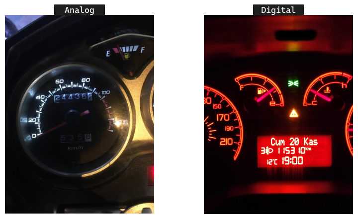
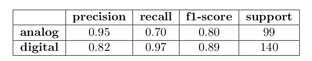
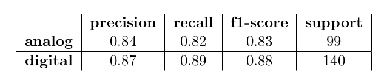
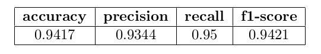
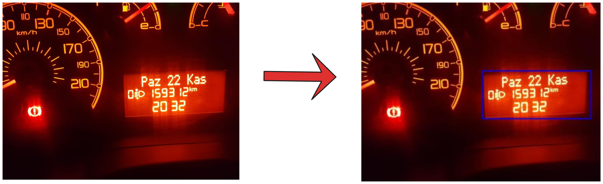
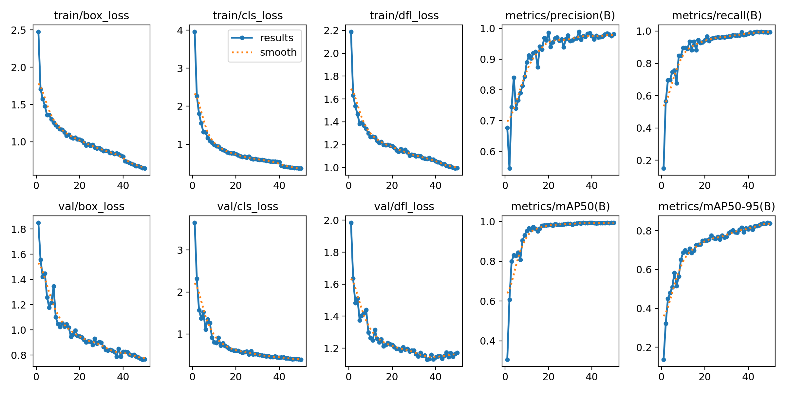
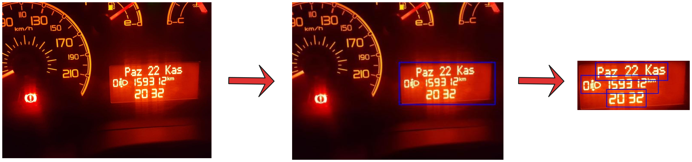

# Odometer Detection & Mileage Extraction

In this project, I will use <b>[TRODO](https://www.sciencedirect.com/science/article/pii/S2352340921006053)</b> dataset to use different classification algorithms to categorize analog and digital odometers. Moreover, I will use object detection algorithms to shrink regions of interest to extract odometer values with an Optical Character Recognition (OCR) algorithm.

## Dataset
The dataset consists of <b>2389</b> raw images with proper ground truth labels. the dimensions of the images have a distribution of different sizes. The most common sizes are <b>768x1024</b>, <b>576x1024</b> and <b>1200x1600</b> with a frequency of <b>468</b>, <b>389</b> and <b>317</b> respectively. Since machine learning models require fixed-size input, these different-sized images will be resized to the same shape as a pre- processing step.

The number of analogs is 759 while the number of digitals is 1391. Thus,
digital values are more dominant when training models.

## Image Classification
Before training my model, I applied some preprocessing steps. I resized the images to <b>256x256</b> because both machine learning models require fixed-size inputs and a larger number of parameters makes it difficult for the model to run fast. Then, I normalised the value of the images by dividing by 255, which is the largest value of a pixel. Also, the images are 3D arrays but K-NN, decision trees and fully connected neural networks require 1D vector inputs to be trained. Therefore, I flattened these arrays, except CNNs, by multiplying the dimensions, <b>256x256x3 = 196608</b> features, to feed the models. Since machine learning models do not know how to handle string values such as analog and digital, I converted these strings to 0 and 1 as labels, respectively. Finally, I split <b>90% (2150)</b> and <b>10% (239)</b> of my dataset into training and test sets.

<ol>
    <li><b>K-Nearest Neighbors (K-NN)</b></li>
    

    <li><b>Decision Trees</b></li>
    

    <li><b>CNN (Pretrained VGG16)</b></li>
    

</ol>

## Object Detection
Object detection requires more effort because the algorithms have special data format so I needed to convert these values. Furthermore, I split <b>80% (1911)</b>, <b>10% (239)</b> and <b>10% (239)</b> of my dataset into training, validation and test sets to fine-tune hyperparameters and monitor the performance of the model. As a object detection algorithm, I preferred to use the <b>YOLOv8</b> algorithm to obtain the best results.

## Optical Character Recognition (OCR)
An OCR software extracts and reuses data from scanned documents, camera images and image-only PDFs. OCR software selects letters in the image, converts them into words and then converts words into sentences, thus providing access and editing of the original content. In my project, I used this technology to try to extract mileage from bounding boxes in odometer images. The tool I used for milage extraction is <b>EacyOCR</b> , which is one of the most popular, accurate and easy-to-use OCR tools. I adjusted this tool to extract only digits instead of alphanumeric values so the name of weekdays, ’km’ or other characters won’t be taken into account.

